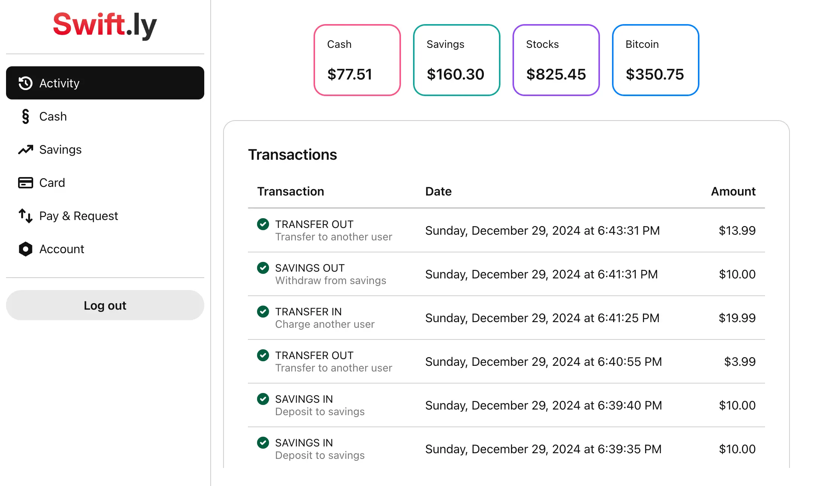

# Swiftly


A modern three-tier digital payments application inspired by Cash App and Venmo. Built with TypeScript, React, Node.js, and PostgreSQL.

## 🌟 Features

- Instant money transfers between users
- Digital wallet management
- Savings account functionality
- Card management system
- Transaction history tracking
- User-friendly interface inspired by modern fintech apps

## 📸 Screenshots



## 📁 Project Structure

```
├── client/
│   ├── app/
│   │   ├── routes/
│   │   ├── root.tsx
│   │   ├── entry.client.tsx
│   │   └── entry.server.tsx
│   └── public/
├── server/
│   ├── routes/
│   ├── db/
│   │   └── schema/
│   └── index.ts
└── infra/
```

## 🚀 Getting Started

### Installation

1. Clone the repository:
```bash
git clone https://github.com/yourusername/swiftly.git
cd swiftly
```

2. Start the application using Docker Compose:
```bash
docker-compose up
```

The application should now be running at `http://localhost:3000`

To stop the application:
```bash
docker-compose down
```

## 🔄 API Endpoints

| Endpoint | Method | Description |
|----------|---------|-------------|
| `/payments` | POST | Create new payment |
| `/savings` | GET | Get savings information |
| `/savings/deposit` | POST | Make a deposit to savings |
| `/savings/withdraw` | POST | Withdraw from savings |
| `/transactions` | GET | Get transaction history |
| `/users` | GET | Get user information |
| `/wallet` | GET | Get wallet information |
| `/wallet/cards` | GET | Get cards list |
| `/wallet/cash/deposit` | POST | Deposit cash |
| `/wallet/cash/withdraw` | POST | Withdraw cash |

## 💾 Database Schema

The application uses four main tables:
- `users`: Stores user information and balances
- `cards`: Manages linked payment cards
- `payments`: Records user-to-user payments
- `transactions`: Tracks all financial transactions

## 🛠️ Built With

- [TypeScript](https://www.typescriptlang.org/)
- [React](https://reactjs.org/)
- [Remix](https://remix.run/)
- [Node.js](https://nodejs.org/)
- [Express](https://expressjs.com/)
- [PostgreSQL](https://www.postgresql.org/)
- [Drizzle ORM](https://orm.drizzle.team/)
- [Docker](https://www.docker.com/)

## 📄 License

This project is licensed under the MIT License - see the [LICENSE](LICENSE) file for details.
